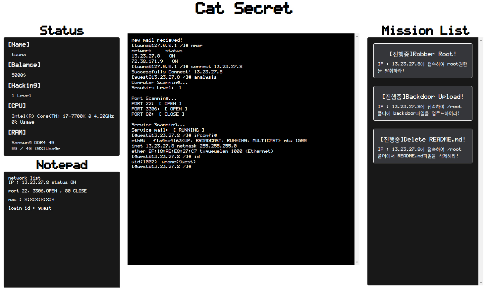
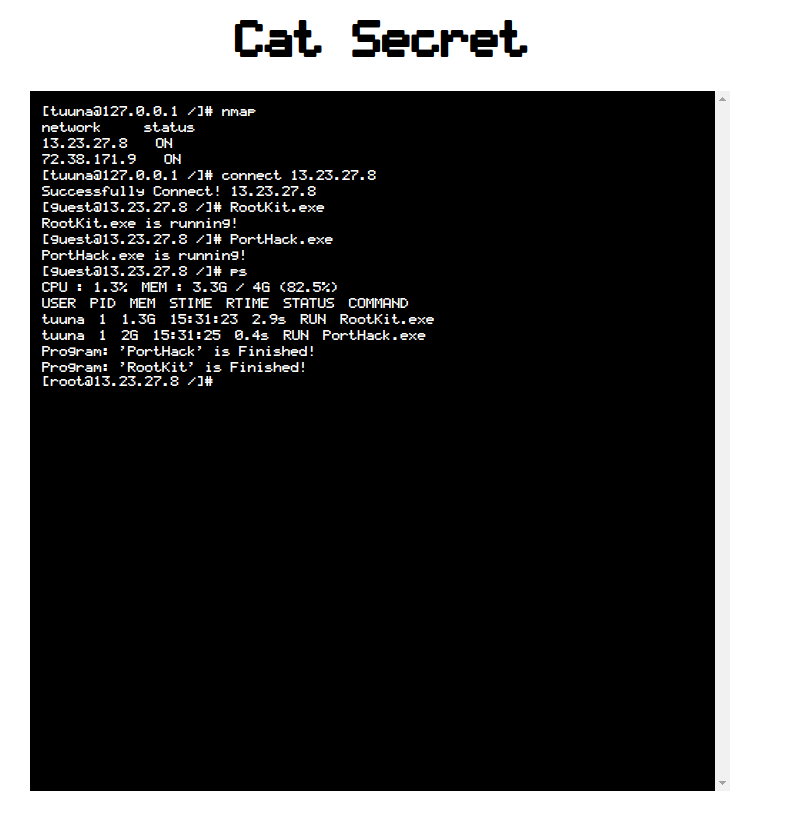

# Cat Secret 
주어진 가상의 리눅스를 기반으로 네트워크에 연결된 PC를 탐험하고 정보를 수집하고 해킹하며 미션을 클리어하는 게임입니다. Hacknet 및 Uplink에서 영감을 받아 개발을 진행하고 있습니다.  

## Update Log
[...] ... Commit 참조  
[2022/09/19] 쉘에서 사용가능한 툴(PortHack.exe, RootKit.exe) 구현  
[2022/09/19] MissionManager Class와 Mission Class의 초안 작성 및   getAdminMission 구현체 작성   

## Todo List 
### 기능
- [X] 유저 별로 권한 확인하기 
- [ ] redirection shell 구현 
- [X] log 
- [X] Mail Service 
- [X] Mission Class 구현
- [X] 세부 미션 구현
- [X] VIM Editor 구현 
- [ ] 경로, 파일, 폴더 이름명에 특수문자 제거 
- [X] computer restart 및 boot log 작성 -> syslog.log
- [ ] passwd, shadow와 같은 유저 관리 파일 생성
- [X] 프로그램의 기본적인 형태 구현 - PortHack, RootKit
- [ ] wget을 통한 상점 기능 구현하기
- [X] 채굴 명령어를 통해 돈 송금
- [ ] 프로그램 로깅 남기기

### 명령어 
- [X] help      도움말을 출력한다. 
- [X] history   지금까지 쳤던 명령어를 보여준다. 
- [X] id        현재 로그인된 계정을 보여준다. 
- [X] login     현재 로그인되어 있는 계정을 변경한다. [USER] [PASSWORD]
- [X] nmap      현재 네트워크상에서 식별된 노드를 검색한다. 
- [X] connect   해당 네트워크 노드와 연결을 시도한다. [IP] [OPTION -P] [PASSWORD]
- [X] home      연결된 세션을 끊고 로컬세션으로 돌아온다. 
- [X] ls        현재 디렉토리에 존재하는 파일 및 디렉토리의 이름을 출력한다. 
- [X] ls -al    현재 디렉토리에 존재하는 파일 및 디렉토리의 세부정보를 출력한다. 
- [X] pwd       현재 있는 경로를 출력한다. 
- [X] ifconfig  네트워크 인터페이스를 출력한다. 
- [X] cd        현재 디렉토리를 주어진 인자로 변경한다. [PATH]
- [X] cat       현재 경로에 있는 파일의 내용을 확인한다. [FILE]
- [X] rm        현재 경로에 있는 파일을 삭제한다. [FILE]
- [X] rmdir     현재 경로에 있는 폴더를 삭제한다. [FOLDER]
- [X] mkdir     현재 경로에 폴더를 생성한다. [FOLDER]
- [X] touch     현재 경로에 빈 파일을 생성한다. [FILE]
- [X] chown     파일 및 폴더의 소유자 변경 [-File or -Folder] [USER] [FILE OR FOLDER]
- [X] passwd    해당 유저의 비밀번호 변경 [PASSWORD] [CONFIRM PASSWORD]
- [X] mkdir     현재 경로에 폴더를 생성한다. [FOLDER]
- [X] touch     현재 경로에 파일을 생성한다. [FILE]
- [X] rm        현재 경로에 있는 파일을 삭제한다. [FILE]
- [X] rmdir     현재 경로에 있는 폴더를 삭제한다. [FOLDER]
- [ ] find      찾고자 하는 옵션을 넣어 원하는 파일 및 폴더를 찾아낸다. 
- [X] chmod     파일 및 폴더의 권한을 변경 [mod] [-FOLDER OR -FILE] [FILE OR FOLDER]
- [X] reboot    컴퓨터를 재부팅한다. 5초뒤 켜짐
- [ ] mv        현재 경로에 있는 파일 및 폴더의 이름을 변경한다. [FILE OR FOLDER]
- [ ] cp        현재 경로에 있는 파일 및 폴더를 복사하여 해당 위치에 복한다. 
- [X] analysis  현재 컴퓨터를 분석한다. (포트개방여부, 램, cpu, 등등)
- [X] VIM       가상의 편집기를 오픈한다. [FILENAME]
- [ ] tree      현재 위치에서의 파일시스템 구조를 트리형식으로 출력한다.
- [X] mail      메일을 보내거나 받은 메일을 읽는다. 
OPTION : [-S] [CONTENT] [User@IP]   메일을 해당 user의 ip로 보냄 
OPTION : [-R]   로그인된 계정의 메일을 읽음  
- [X] systemd   서비스 관련 명령어를 내린다. ex) systemd mail stop 
- [X] ps        현재 돌아가는 프로그램의 상태를 출력한다. 


## Mission System
MissionManager Class와 Mission Class를 기반으로 동작
MissionManager Class는 Mission Class의 객체를 관리하고 있으며 매 프레임마다 Mission 객체의 update 메소드 호출 
Mission Class는 매 프레임 호출되는 update 메소드에서 Mission의 isComplete확인

Mission은 크게 아래와 같다 
- FileUploadMission
- FileDeleteMission
- FileDownloadMission
- getAdminMission


## 파일 시스템 
파일시스템은 크게 FileSystem Class와 폴더와 파일을 이루는 Folder Class와 File Class로 이루어져있다. 
FileSystem 클래스는 전반적인 컴퓨터의 파일시스템을 구성하고 있으며 root를 통해 root Folder를 가리킨다. 

Folder클래스는 파일시스템에 존재하는 폴더를 의미하며 Property로 Folder Class와 File Class를 가진다. AddFile, AddFolder를 통해서 폴더나 파일을 추가가 가능하다. 

FileStat Class는 Folder Class와 File Class를 상속하고 있으며 사이즈, 소유자, 권한과 같은 stat부분을 관리하는 Class이다.

전반적인 컴퓨터에 존재하는 파일시스템의 디렉토리 구성도는 아래와 같다. 

```
/
└───var
│   └───log
│       │   auth.log
│       │   history.log
│       │   syslog.log
└───home
│   └───user
│       │   README.md
└───root
└───etc
│   │   passwd
│   │   shadow
│   │   config.ini
└───bin
└───mail
│   └───account
│   │   └───user1
│   │   │   └───inbox 
│   │   │   └───sent
│   │   └───user2 
│   │   │   └───inbox 
│   │   │   └───sent
└───tmp
```

## OS System 
Computer마다 OS가 있는 것이 아닌 하나의 OS에 여러 Computer Class를 연결하였다. 
즉, 하나의 OS는 사용자를 위한 OS이며 네트워크에 연결된 AI Computer는 OS를 가지지 않는다.
OS는 isConnected Property를 통해 현재 사용자의 Computer가 아닌 다른 네트워크의 Computer에 연결되었는지를 확인하며 해당 Property에 따라 실행 및 프로그램의 동작되는 Computer가 달라진다. 

Terminal, Vim, Status, Mission의 HTML을 렌더링하며 매 프레임마다 update를 시켜준다.  터미널로부터 입력받은 문자열이 Computer의 Command인지 아니면 OS에 해당하는 Program인지를 확인함. 
Command일시 Computer Class에 전달하며 Program일시 OS자체적으로 관리하여 매 프레임마다 update함수 호출 
또한 플레이어의 CPU, RAM, Balance등을 관리한다. 
실질적으로 Game객체과 Computer객체와의 중간역할 

## Computer System 
Computer Class는 Command, FileSystem, Services, log, Port등을 관리하며 실질적인 Computer의 컴퓨터를 진행한다. OS Class로 부터 받은 Command문자열을 Command 객체에게 전달해주어 명령어의 실행을 도와주며 처리과정또한 Computer Class가 처리한다. 해당 Class는 기본적인 파일 관리(삭제,  생성) 및 사용자 관리, 포트관리, 권한관리를 진행한다. 

## Program System 
Program Class는 사용자가 입력하는 프로그램의 실행을 돕는 Class이다.  
사용자로부터 Program의 사용 요청이 들어오면 Ram사용유무와 인자유무를 판단하고 Tools Class로부터 맞는 Tools Object를 생성하며 os의 프로세스 관리 리스트에 추가한다. 추가된 Tools Object는 매 프레임마다 update하여 상태를 확인한다. 
현재 사용가능한 프로그램으로는 RootKit, PortHack, MineHack이 존재한다. 

## Service System 
Service Class로는 일반 리눅스로치면 Daemon의 역할을 진행하고 있다. 자체적인 Filesystem을 가지고 있으며 백그라운드환경에서 실행된다. Service의 예로서는 mail Class가 존재한다. Mail Class는 네트워크에 연결된 PC끼리 메일을 주고 받을 수 있는 서비스이다. 서비스를 관리하는 명령어로는 systemd가 있다. 

## Commander System 
명령어를 통해 Computer 객체를 조작할 수 있는 Class이다. 해당 Class는 각 각의 Computer Class에 객체로서 생성되며 일반적인 리눅스 명령어를 포함하고 있다. 해당 명령어의 결과를 통해 computer의 property를 변경한다. 

## Log System 
해당 Class는 사용자의 입력 및 백그라운드에서 실행되는 Daemon의 모든 logging을 남기는 Class이다. 해당 Class에 존재하는 로그파일로는 auth.log, history.log, syslog.log파일이 존재한다. 

## Terminal System 
터미널의 UI단을 수정하는 Class이다. 사용자의 인터렉션을 통해 terminal class를 이용하여 터미널의 내용을 수정할 수 있다. 

## Vim System 
VIM은 터미널화면을 잠시 닫은 상태에서 실행이 가능하다. 실제 리눅스 VIM EDITOR처럼 되어 있으며 파일의 편집 및 생성이 가능하다. VIM에는 Insert모드와 Normal모드가 존재하며 Insert Mode에서만 편집이 가능하다. Normal모드에서는 VIM EDITOR를 나가서 Terminal Mode로 변경이 가능하다.

# Image 
### Cat Secret Main Screen

### Mail Daemon System

### FileSystem

### NetWork System

### VIM EDITOR System

### Hacking Tools Usage



