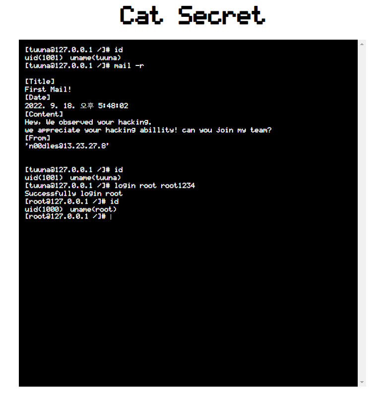
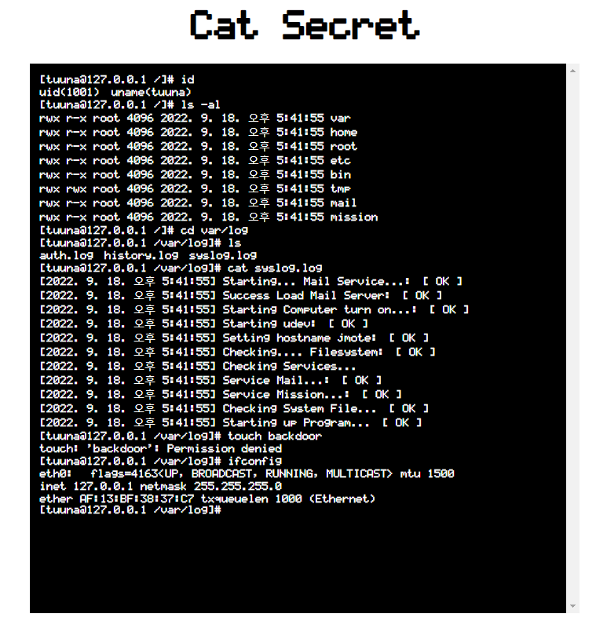
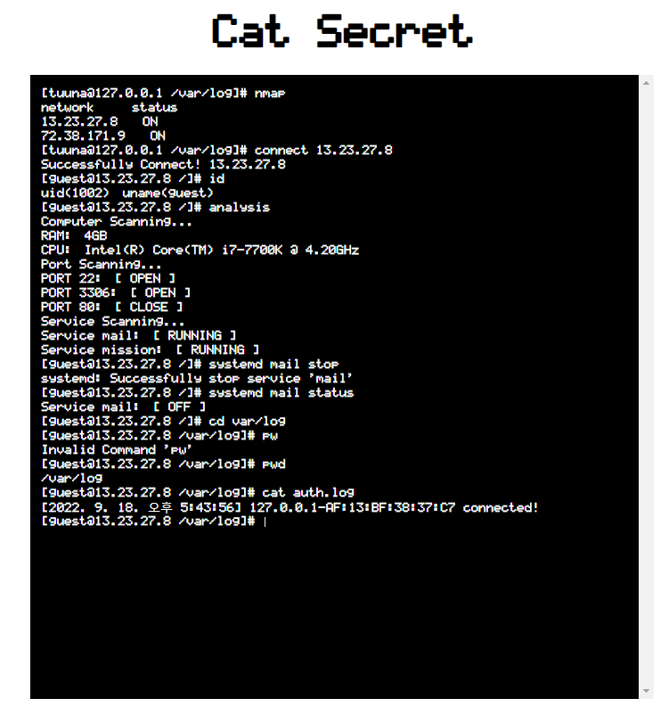

# Cat Secret 
주어진 가상의 리눅스를 기반으로 네트워크에 연결된 PC를 탐험하는 게임! 

# Todo List 

## 기능
- [X] 유저 별로 권한 확인하기 
- [ ] redirection shell 구현 
- [X] log 
- [ ] Mail Service 
- [ ] Mission Service
- [ ] VIM Editor 구현 
- [ ] 경로, 파일, 폴더 이름명에 특수문자 제거 
- [X] computer restart 및 boot log 작성 -> syslog.log
- [ ] passwd, shadow와 같은 유저 관리 파일 생성

## 명령어 
- [X] help      도움말을 출력한다. 
- [X] history   지금까지 쳤던 명령어를 보여준다. 
- [X] id        현재 로그인된 계정을 보여준다. 
- [X] login     현재 로그인되어 있는 계정을 변경한다. [USER] [PASSWORD]
- [X] nmap      현재 네트워크상에서 식별된 노드를 검색한다. 
- [X] connect   해당 네트워크 노드와 연결을 시도한다. [IP] [OPTION -P] [PASSWORD]
- [X] home      연결된 세션을 끊고 로컬세션으로 돌아온다. 
- [X] ls        현재 디렉토리에 존재하는 파일 및 디렉토리의 이름을 출력한다. 
- [X] ls -al    현재 디렉토리에 존재하는 파일 및 디렉토리의 세부정보를 출력한다. 
- [X] pwd       현재 있는 경로를 출력한다. 
- [X] ifconfig  네트워크 인터페이스를 출력한다. 
- [X] cd        현재 디렉토리를 주어진 인자로 변경한다. [PATH]
- [X] cat       현재 경로에 있는 파일의 내용을 확인한다. [FILE]
- [X] rm        현재 경로에 있는 파일을 삭제한다. [FILE]
- [X] rmdir     현재 경로에 있는 폴더를 삭제한다. [FOLDER]
- [X] mkdir     현재 경로에 폴더를 생성한다. [FOLDER]
- [X] touch     현재 경로에 빈 파일을 생성한다. [FILE]
- [X] chown     파일 및 폴더의 소유자 변경 [-File or -Folder] [USER] [FILE OR FOLDER]
- [X] passwd    해당 유저의 비밀번호 변경 [PASSWORD] [CONFIRM PASSWORD]
- [X] mkdir     현재 경로에 폴더를 생성한다. [FOLDER]
- [X] touch     현재 경로에 파일을 생성한다. [FILE]
- [X] rm        현재 경로에 있는 파일을 삭제한다. [FILE]
- [X] rmdir     현재 경로에 있는 폴더를 삭제한다. [FOLDER]
- [ ] find      찾고자 하는 옵션을 넣어 원하는 파일 및 폴더를 찾아낸다. 
- [X] chmod     파일 및 폴더의 권한을 변경 [mod] [-FOLDER OR -FILE] [FILE OR FOLDER]
- [X] reboot    컴퓨터를 재부팅한다. 5초뒤 켜짐
- [ ] mv        현재 경로에 있는 파일 및 폴더의 이름을 변경한다. [FILE OR FOLDER]
- [ ] cp        현재 경로에 있는 파일 및 폴더를 복사하여 해당 위치에 복한다. 
- [X] analysis  현재 컴퓨터를 분석한다. (포트개방여부, 램, cpu, 등등)
- [X] VIM       가상의 편집기를 오픈한다. [FILENAME]
- [ ] tree      현재 위치에서의 파일시스템 구조를 트리형식으로 출력한다.
- [X] mail      메일을 보내거나 받은 메일을 읽는다. 
OPTION : [-S] [CONTENT] [User@IP]   메일을 해당 user의 ip로 보냄 
OPTION : [-R]   로그인된 계정의 메일을 읽음  
- [X] systemd   서비스 관련 명령어를 내린다. ex) systemd mail stop 


## 파일 시스템 
```
/
└───var
│   └───log
│       │   auth.log
│       │   history.log
│       │   syslog.log
└───home
│   └───user
│       │   README.md
└───root
└───etc
│   │   passwd
│   │   shadow
│   │   config.ini
└───bin
└───mail
│   └───account
│   │   └───user1
│   │   │   └───inbox 
│   │   │   └───sent
│   │   └───user2 
│   │   │   └───inbox 
│   │   │   └───sent
└───mission
└───tmp
```
# Image 





